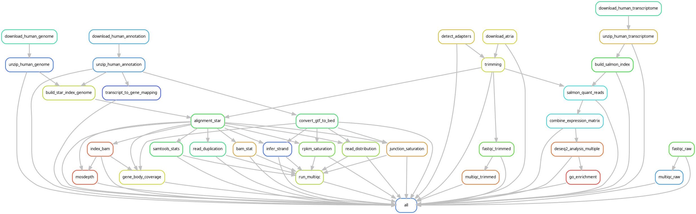

# Bulk RNA sequencing pipeline
Snakemake pipeline processes paired-end FASTQ files through quality control, alignment, transcript quantification, differential expression analysis (DESeq2), and GO enrichment analysis 

## Pipeline Features

- **FastQ Quality Control** (`FastQC`, `MultiQC`)
- **Adapter Trimming** (`Atria`)
- **Read Alignment** (`STAR`)
- **Read Alignment QC** (`MultiQC`)
- **Transcript Quantification** (`Salmon`)
- **Quality Control Metrics** (`RSeQC`, `samtools`)
- **Differential Expression Analysis** (`DESeq2`)
- **GO Enrichment Analysis** (`clusterProfiler`)




## 📥 Installation

### 1️⃣ Install Dependencies

```bash
conda install -c bioconda snakemake
```

### 2️⃣ Clone the Repository
```bash
git clone https://github.com/your_username/Bulk_RNA_seq.git
cd Bulk_RNA_seq
```

## User Input Files

### Sample Sheet

Currently, you can perform analysis on paired-end reads. You must provide a CSV file describing your samples. (If your data are in Excel format, please convert them to CSV or modify the pipeline accordingly.) The sample sheet should contain the following columns:

- **group**: Experimental group (e.g., cell line or condition)
- **sample_id**: A unique identifier for each sample
- **replicate**: Replicate number (e.g., 1, 2, …)
- **fastq_1**: Path or URL for the raw FASTQ file (read 1)
- **fastq_2**: Path or URL for the raw FASTQ file (read 2)
- **genome**: Genome build used (e.g., "hg38" or "mm39")

**Example:**

```csv
group,sample_id,replicate,fastq_1,fastq_2,genome
GM12878,SRR3192657,1,s3://nf-core-awsmegatests/rnaseq/input_data/SRX1603629_T1_1.fastq.gz,s3://nf-core-awsmegatests/rnaseq/input_data/SRX1603629_T1_2.fastq.gz,hg38
GM12878,SRR3192658,2,s3://nf-core-awsmegatests/rnaseq/input_data/SRX1603630_T1_1.fastq.gz,s3://nf-core-awsmegatests/rnaseq/input_data/SRX1603630_T1_2.fastq.gz,hg38
K562,SRR3192408,1,s3://nf-core-awsmegatests/rnaseq/input_data/SRX1603392_T1_1.fastq.gz,s3://nf-core-awsmegatests/rnaseq/input_data/SRX1603392_T1_2.fastq.gz,hg38
...
```

This file should be named as sample_sheet.csv and move into the data folder

```yaml
sample_sheet: "data/sample_sheet.csv"
```

## Comparisons File

Provide a CSV file defining the comparisons for differential expression analysis. (If your file is in Excel format, convert it to CSV or adjust the Snakefile to use pd.read_excel.)

The comparisons file should include the following columns:

comparison_number: A unique identifier for the comparison
treatment: Name of the treatment group
control: Name of the control group

```csv
comparison_number,treatment,control
1,GM12878,K562
2,MCF7,H1
```
Place this file in the data/ directory (e.g., as data/comparison.csv), or update the Snakefile accordingly.

## 🚀 Running the Pipeline

### 1️⃣ Test Pipeline Execution (Dry Run)
```bash
snakemake --use-conda -np
```

### 2️⃣ Run the Full Pipeline
```bash
snakemake --use-conda --rerun-triggers mtime --cores 30
```
💡 *Adjust `--cores` based on your system's available CPUs.*

## License

This project is licensed under the MIT License - see the [LICENSE](LICENSE) file for details.
