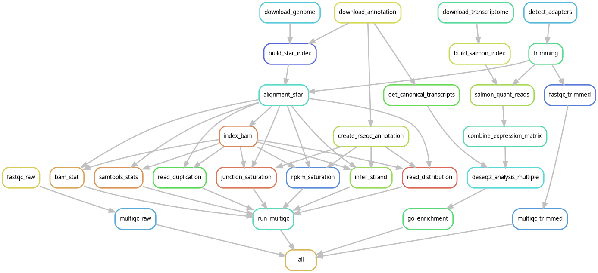

# Bulk RNA sequencing pipeline

Snakemake pipeline processes paired-end FASTQ files through quality control, alignment,
transcript quantification, differential expression analysis (DESeq2), and GO enrichment
analysis


## Pipeline Features

- **FastQ Quality Control** (`FastQC`, `MultiQC`)
- **Adapter Trimming** (`Atria`)
- **Read Alignment** (`STAR`)
- **Read Alignment QC** (`MultiQC`)
- **Transcript Quantification** (`Salmon`)
- **Quality Control Metrics** (`RSeQC`, `samtools`)
- **Differential Expression Analysis** (`DESeq2`)
- **GO Enrichment Analysis** (`clusterProfiler`)




## 📥 Installation

### Clone the Repository

```bash
git clone https://github.com/your_username/Bulk_RNA_seq.git
cd Bulk_RNA_seq
```


### Install Dependencies

#### Snakemake

```bash
conda install -c bioconda pandas snakemake=8.25.0
```

It is best to stick with version `8.25.0` of Snakemake as the pipeline was optimised
with this version.


#### atria

We use [atria](https://github.com/cihga39871/Atria) version 4.1.1 for trimming the
adapters.

##### Use singularity (default)

> [!NOTE]
> Singularity/Apptainer must be install on all machines running the pipeline

Build the image

```bash
cd atria
sudo singularity build atria-4.1.1.sif atria.def
export ATRIA_IMG_DIR=$PWD
```

Set `SINGULARITY_CACHEDIR` or use `--apptainer-prefix $ATRIA_IMG_DIR` with the Snakemake
command

```bash
export SINGULARITY_CACHEDIR=$ATRIA_IMG_DIR
```


##### Install atria locally

You install it on your machine using the script `install_atria.sh` in
`workflow/scripts`.

You will need to add it to your path and your `.bashrc`:

```bash
export PATH=$PATH:<path to atria>/atria-4.1.1/bin
```


## User Input Files

### Sample Sheet

Currently, you can perform analysis on paired-end reads. You must provide a CSV
file describing your samples. If your data are in Excel format, it can be easily
save as a CSV file. The sample sheet should contain the following columns:

- **group**: Experimental group (e.g., cell line or condition), only used with the
  comparison file
- **sample_id**: A unique identifier for each sample, needs to match with samplename
- **replicate**: Replicate number (e.g., 1, 2, …), optional, this is for information
  only and is not used by the pipeline
- **fastq_1**: The absolute path to the fastq files with the first read pairs
- **fastq_2**: The absolute path to the fastq files with the second read pairs

**Example:**

```csv
group,sample_id,replicate,fastq_1,fastq_2
GM12878,SRR3192657,1,/data/myexperiment_1/SRR3192657_1.fastq.gz,/data/myexperiment_1/SRR3192657_2.fastq.gz
GM12878,SRR3192658,2,/data/myexperiment_1/SRR3192658_1.fastq.gz,/data/myexperiment_1/SRR3192658_2.fastq.gz
K562,SRR3192408,1,/data/myexperiment_2/SRR3192408_1.fastq.gz,/data/myexperiment_2/SRR3192408_2.fastq.gz
...
```

The default name is `sample_sheet.csv` and its default location is in the `data`
folder. However, you can edit the configuration file `config/config.yml`

```yaml
sample_sheet: "data/sample_sheet.csv"
```

Or you can specify the path to the file on the command line:

```bash
snakemake --software-deployment-method conda --config sample_sheet=<path/to/config>
```


### Raw fastq files

The pipeline will use the path found in the sample sheet to locate the FASTQ files.


### Comparisons File

> [!INFO]
> If you do not want to compare the gene expression levels between samples, set
> `do_comparisons` to false but leave the default value of `data/comparison.cvs`
> in your config.

Provide a CSV file defining the comparisons for differential expression analysis.
The comparisons file should include the following columns:

- **comparison_number**: A unique identifier for the comparison
- **treatment**: Name of the treatment group
- **control**: Name of the control group

```csv
comparison_number,treatment,control
1,GM12878,K562
2,MCF7,H1
```

The default name is `comparison.csv` and its default location is in the `data`
folder. However, you can edit the configuration file `config/config.yml`

```yaml
comparison_sheet: "data/comparison.csv"
```

Or you can specify the path to the file on the command line:

```bash
snakemake --software-deployment-method conda --config comparison_sheet=<path/to/config>
```


## 🚀 Running the Pipeline

### 1️⃣ Test Pipeline Execution (Dry Run)

```bash
snakemake --software-deployment-method conda -np
```


### 2️⃣ Run the Full Pipeline

#### Using the default Snakemake way

By default, Snakemake expects you to run the pipeline in the pipeline repository
and all files and folders will be created in the pipeline directory

```bash
snakemake --software-deployment-method conda singularity --singularity-args "-B $HOME" --rerun-triggers mtime --cores 30
```

💡 *Adjust `--cores` based on your system's available CPUs. It will be the limit*

> [!INFO]
> Snakemake mount the current directory in Singularity with `--home`. You may need
> to use `--singularity-args` to mount the directory where your input and output
> FASTQ files from trimming would be


#### Using a specific output directory

> [!TIP]
> It is worth using absolute path in the config file to avoid troubles later

```bash
snakemake --software-deployment-method conda singularity --singularity-args "-B $HOME" --rerun-triggers mtime --directory <path to your output files> --configfile $PWD/config/config.yaml
```

The following parameters would need to be update in the config or with
`--config KEY=VALUE`

- sample_sheet
- comparison_sheet
- atria_image


#### Pipeline options

- `trim_reads`: Set to false if reads do not need to be trimmed. The trimming
  software, `atria`, is doing other cleaning, it might be worth keeping it. If
  it doesn't find adapters, it doesn't remove them.
- `do_comparisons`: Set to false if you do not want to run DESeq2 and GO enrichments
  analyses


#### Useful snakemake parameters

- `--directory PATH`: set the pipeline directory to the path provided
- `--configfile PATH`: set the path to the config file to use, needed if using
  `--directory` or you will have problems with relative paths
- `--snakefile PATH`: set the path to the Snakemake file to use, needed if you
  want to run the pipeline outside of the pipeline repository.
- `--config KEY=VALUE`: set a value from the config file with the CLI
- `--max-threads`: Limit the number of threads to use